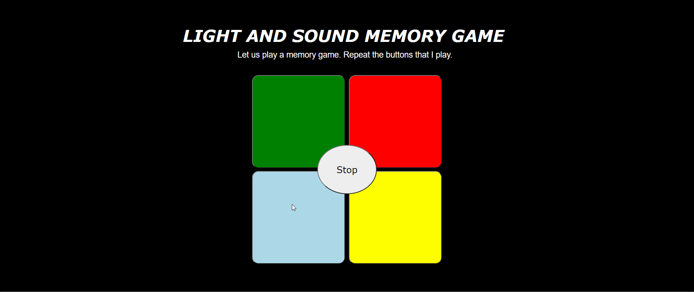

# Pre-work - *Memory Game*

**Memory Game** is a Light & Sound Memory game to apply for CodePath's SITE Program. 

Submitted by: **Jillian Naldrien Pantig**

Time spent: **4** hours spent in total

Link to project: https://glitch.com/edit/#!/lightandsoundmemgame

## Required Functionality

The following **required** functionality is complete:

* [x] Game interface has a heading (h1 tag), a line of body text (p tag), and four buttons that match the demo app
* [x] "Start" button toggles between "Start" and "Stop" when clicked. 
* [x] Game buttons each light up and play a sound when clicked. 
* [x] Computer plays back sequence of clues including sound and visual cue for each button
* [x] Play progresses to the next turn (the user gets the next step in the pattern) after a correct guess. 
* [x] User wins the game after guessing a complete pattern
* [x] User loses the game after an incorrect guess

The following **optional** features are implemented:

* [x] Any HTML page elements (including game buttons) has been styled differently than in the tutorial
* [x] Buttons use a pitch (frequency) other than the ones in the tutorial
* [ ] More than 4 functional game buttons
* [ ] Playback speeds up on each turn
* [x] Computer picks a different pattern each time the game is played
* [ ] Player only loses after 3 mistakes (instead of on the first mistake)
* [ ] Game button appearance change goes beyond color (e.g. add an image)
* [ ] Game button sound is more complex than a single tone (e.g. an audio file, a chord, a sequence of multiple tones)
* [ ] User has a limited amount of time to enter their guess on each turn

The following **additional** features are implemented:

- [ ] List anything else that you can get done to improve the app!

## Video Walkthrough

Here's a walkthrough of implemented user stories:

 

## Reflection Questions
1. If you used any outside resources to help complete your submission (websites, books, people, etc) list them here. 
[W3SCHOOLS - https://www.w3schools.com/]
[MDN Web Docs - https://developer.mozilla.org/en-US/docs/web/javascript/reference/global_objects/math/random]

2. What was a challenge you encountered in creating this submission (be specific)? How did you overcome it? (recommended 200 - 400 words) 
[Since I do not have any prior knowledge regarding HTML, CSS, and JavaScript, I am so confused at the beginning of the pre-work assignment. 
It took me several minutes to understand functions and syntax that are new to my brain. Nonetheless, I managed to overcome such difficulty 
through the help of the links that CodePath gave in the assignment. As I go through every step, I made sure to read the definition of each 
unfamiliar keyword that I encounter in order to fully understand their nature and concept. I also encountered challenges in terms of designing 
my game. As I was very new to CSS and HTML, I had to do a trial-and-error in terms of editing button shapes, margins, and the like just to make
my webpage pleasant and neat.]

3. What questions about web development do you have after completing your submission? (recommended 100 - 300 words) 
[Questions that mainly concern designing, logic, and security came up into my mind after completing my submission. For instance, 
How do gaming sites create a very complex UI?
How do gaming sites incorporate their complex logic to their website design?
How do gaming sites allow a character to walk?
How do shopping and banking sites implement data security?
Can other people edit my webpage?
How do people incorporate real money into a webpage?
How can google chrome handle several websites at once?
]

4. If you had a few more hours to work on this project, what would you spend them doing (for example: refactoring certain functions, adding additional features, etc). Be specific. (recommended 100 - 300 words) 
[If I had a few more hours to work on this project, I would spend them in implementing game levels, incorporating sounds that builds into a famous tune when the highest level is reached, incorporating a background 
sound when the game is not being played, improving my game’s design to make it more attractive to the user, and so on.]

## License

    Copyright [Jillian Naldrien Pantig]

    Licensed under the Apache License, Version 2.0 (the "License");
    you may not use this file except in compliance with the License.
    You may obtain a copy of the License at

        http://www.apache.org/licenses/LICENSE-2.0

    Unless required by applicable law or agreed to in writing, software
    distributed under the License is distributed on an "AS IS" BASIS,
    WITHOUT WARRANTIES OR CONDITIONS OF ANY KIND, either express or implied.
    See the License for the specific language governing permissions and
    limitations under the License.
